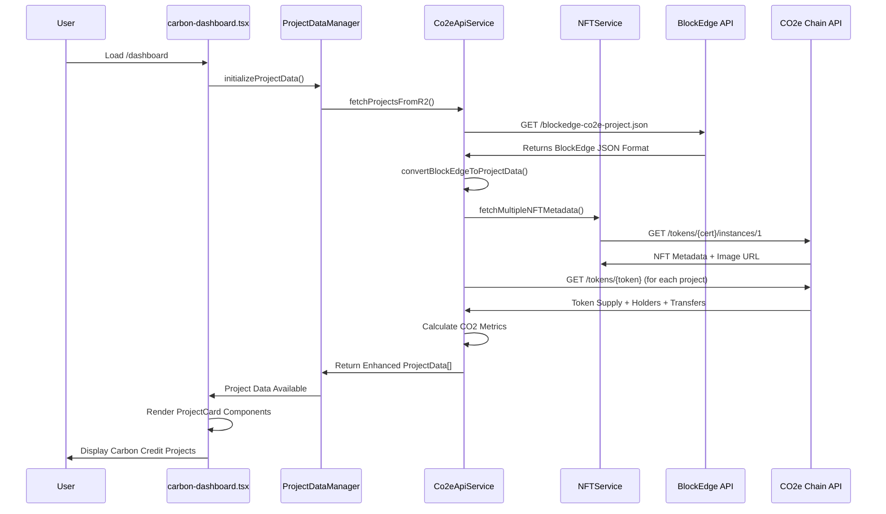
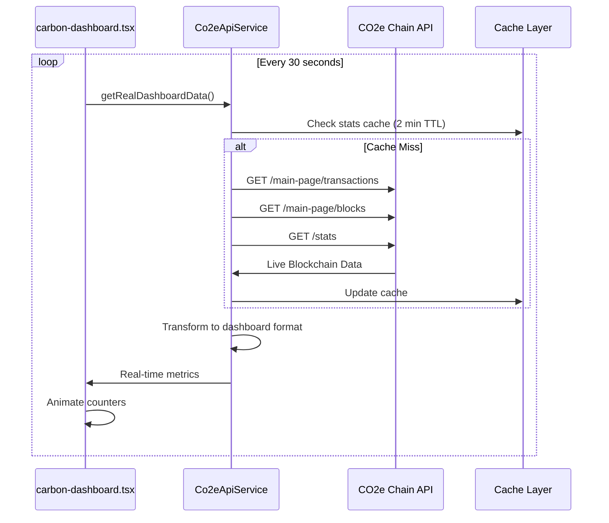
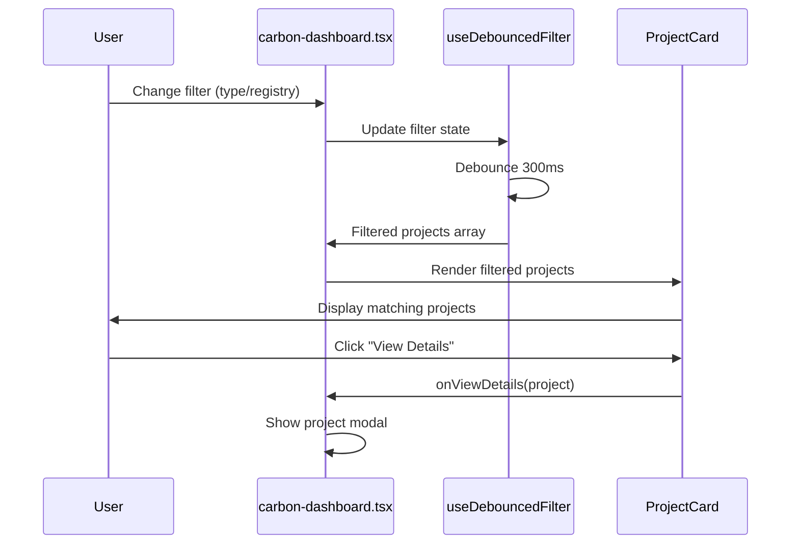

# BlockEdge Dashboard - Complete Data Flow Analysis

## Executive Summary

This document provides a comprehensive analysis of the data flow architecture in the BlockEdge Dashboard application, tracing the complete journey from external APIs through the carbon-dashboard.tsx component to final user presentation.

## 1. High-Level Architecture Overview

### 1.1 System Components
```
┌─────────────────────────────────────────────────────────────────┐
│                    BlockEdge Dashboard                           │
├─────────────────────────────────────────────────────────────────┤
│  Frontend Layer (React/Next.js)                                │
│  ├── carbon-dashboard.tsx (Main Component)                     │
│  ├── ProjectCard Components                                     │
│  └── Loading/Animation Components                               │
├─────────────────────────────────────────────────────────────────┤
│  Data Management Layer                                          │
│  ├── ProjectDataManager (Orchestrator)                         │
│  ├── Co2eApiService (Data Transform)                          │
│  └── NFTService (Certificate Images)                           │
├─────────────────────────────────────────────────────────────────┤
│  Caching Layer                                                  │
│  ├── Projects Cache (5 min TTL)                               │
│  ├── NFT Metadata Cache (30 min TTL)                          │
│  └── Stats Cache (2 min TTL)                                   │
├─────────────────────────────────────────────────────────────────┤
│  API Integration Layer                                          │
│  ├── Next.js API Routes (CORS Proxy)                          │
│  ├── BlockEdge API Client                                      │
│  └── CO2e Chain API Client                                     │
├─────────────────────────────────────────────────────────────────┤
│  External Data Sources                                          │
│  ├── BlockEdge Carbon Credits API                              │
│  ├── CO2e Chain Explorer API                                   │
│  └── NFT Contract Metadata                                     │
└─────────────────────────────────────────────────────────────────┘
```

### 1.2 Data Flow Sequence

## 2. Complete Data Flow Tracing

### 2.1 Initial Page Load Sequence



### 2.2 Real-Time Data Updates



### 2.3 User Interaction Flow



## 3. Data Source Analysis

### 3.1 BlockEdge API Integration

**Primary Endpoint**: `https://asset.blockedge.co/blockedge-co2e-project.json`

**Response Structure**:
```json
{
  "carbonCreditProjects": {
    "VCS": {
      "standardName": "Verified Carbon Standard",
      "standardCode": "VCS",
      "registry": "Verra",
      "projects": [
        {
          "projectId": "VCS1529",
          "projectName": "Inner Mongolia Forest Management Project",
          "token": "0x1234...",
          "cert": "0x5678..."
        }
      ]
    }
  }
}
```

**Current Projects**:
- **VCS1529**: Inner Mongolia Forest Management (Forest Conservation)
- **TVS0021**: BSE Grid Connected Solar PV (Renewable Energy)  
- **BACHES30001**: Bac Ha Hydropower (Renewable Energy)

### 3.2 CO2e Chain API Integration

**Base URL**: `https://exp.co2e.cc/api/v2`

**Key Endpoints Used**:
- `/tokens/{address}` - Token metadata (supply, holders, decimals)
- `/tokens/{address}/transfers` - Transfer history count
- `/tokens/{address}/instances/{tokenId}` - NFT certificate metadata
- `/main-page/transactions` - Recent network transactions
- `/main-page/blocks` - Recent network blocks
- `/stats` - Network statistics

**Data Transformation**:
```typescript
// Token supply → CO2 reduction calculation
const totalSupply = parseFloat(formatUnits(rawSupply, decimals));
const co2Reduction = {
  total: totalSupply.toFixed(2),
  annual: (totalSupply / projectAge).toFixed(2),
  unit: "tCO2e"
};

// Investment calculation based on methodology
const pricePerTon = methodologyPricing[methodology] || 15;
const totalInvestment = (totalSupply * pricePerTon).toFixed(2);
```

### 3.3 NFT Certificate Integration

**Purpose**: Fetch project certificate images and metadata
**Contracts**: ERC-721 certificates linked to each project
**Fallback**: SVG placeholder generation using contract address hash

**Image URL Resolution**:
```typescript
// IPFS URL transformation
ipfs://QmHash... → https://ipfs.io/ipfs/QmHash...

// Relative URL resolution
/api/image/... → https://exp.co2e.cc/api/image/...
```

## 4. Component-Level Data Flow

### 4.1 carbon-dashboard.tsx Data Management

**State Variables**:
```typescript
// Core data state
const [realData, setRealData] = useState<RealDashboardData>({
  heroMetrics: [],
  networkStats: {},
  recentTransactions: [],
  recentBlocks: []
});

const [projects, setProjects] = useState<any[]>([]);
const [projectStats, setProjectStats] = useState<any>({});

// UI state
const [activeTab, setActiveTab] = useState("overview");
const [selectedFilter, setSelectedFilter] = useState("all");
const [selectedRegistry, setSelectedRegistry] = useState("all");
const [isLoading, setIsLoading] = useState(true);
```

**Data Fetching Functions**:
```typescript
// Initial data load
const initializeProjectData = async () => {
  try {
    const projectsData = await co2eApi.getProjects();
    setProjects(projectsData.projects);
    setProjectStats(calculateProjectStats(projectsData.projects));
    setIsLoading(false);
  } catch (error) {
    console.error("Failed to initialize project data:", error);
  }
};

// Real-time updates
const updateRealTimeData = async () => {
  try {
    const dashboardData = await co2eApi.getRealDashboardData();
    setRealData(dashboardData);
  } catch (error) {
    console.error("Failed to update real-time data:", error);
  }
};
```

### 4.2 ProjectCard Component Integration

**Props Interface**:
```typescript
interface ProjectCardProps {
  project: ProjectData;
  index: number;
  onViewDetails: (project: ProjectData) => void;
}
```

**Data Consumption**:
```typescript
// Key data fields used in ProjectCard
const {
  id,
  name,
  type,
  location,
  co2Reduction,
  compliance,
  registry,
  certificationBody,
  methodology,
  images,
  tokenAddress,
  certContract
} = project;
```

### 4.3 Performance Optimizations

**Debounced Filtering**:
```typescript
const useDebouncedFilter = (projects: any[], filters: any, delay = 300) => {
  const [debouncedFilters, setDebouncedFilters] = useState(filters);
  
  useEffect(() => {
    const handler = setTimeout(() => {
      setDebouncedFilters(filters);
    }, delay);
    
    return () => clearTimeout(handler);
  }, [filters, delay]);
  
  return useMemo(() => {
    return projects.filter(project => {
      // Complex filtering logic
    });
  }, [projects, debouncedFilters]);
};
```

**Animation Control**:
```typescript
const usePerformance = () => {
  const [shouldAnimate, setShouldAnimate] = useState(true);
  
  useEffect(() => {
    const checkPerformance = () => {
      const connection = (navigator as any).connection;
      const slowConnection = connection && connection.effectiveType === "slow-2g";
      setShouldAnimate(!slowConnection);
    };
    
    checkPerformance();
  }, []);
  
  return { shouldAnimate };
};
```

## 5. Caching Architecture

### 5.1 Multi-Level Caching Strategy

**Level 1: HTTP Cache (Next.js API Routes)**
```typescript
// /api/projects/route.ts
export async function GET() {
  const response = await fetch(projectsUrl);
  
  return new Response(JSON.stringify(data), {
    headers: {
      'Cache-Control': 'public, max-age=300', // 5 minutes
      'Content-Type': 'application/json',
    },
  });
}
```

**Level 2: Service Layer Cache**
```typescript
// Co2eApiService caching
private cachedProjects: ProjectsResponse | null = null;
private lastFetch: number = 0;

async getProjects(): Promise<ProjectsResponse> {
  const now = Date.now();
  const cacheAge = now - this.lastFetch;
  
  if (this.cachedProjects && cacheAge < config.cache.projectsCacheDuration) {
    return this.cachedProjects;
  }
  
  // Fetch new data
  this.cachedProjects = await this.fetchProjectsFromR2();
  this.lastFetch = now;
  
  return this.cachedProjects;
}
```

**Level 3: NFT Metadata Cache**
```typescript
// NFTService caching with 30-minute TTL
private cache = new Map<string, { data: any; timestamp: number }>();

async fetchNFTMetadata(contractAddress: string, tokenId: string = "1") {
  const cacheKey = `${contractAddress}-${tokenId}`;
  const cached = this.cache.get(cacheKey);
  
  if (cached && Date.now() - cached.timestamp < 30 * 60 * 1000) {
    return cached.data;
  }
  
  // Fetch and cache
  const metadata = await this.fetchFromAPI(contractAddress, tokenId);
  this.cache.set(cacheKey, { data: metadata, timestamp: Date.now() });
  
  return metadata;
}
```

### 5.2 Cache Invalidation Strategy

**Automatic Invalidation**:
- Time-based expiration (TTL)
- URL configuration changes
- API errors with fallback

**Manual Invalidation**:
```typescript
// ProjectDataManager refresh
async refreshData(): Promise<void> {
  await this.co2eApi.clearCache();
  await this.nftService.clearCache();
  // Force new fetch
}
```

## 6. Error Handling & Resilience

### 6.1 Fallback Data Generation

**When Blockchain Data Unavailable**:
```typescript
private generateFallbackDataFromProjectInfo(project: BlockEdgeProject): ProjectData {
  // Use project characteristics to generate realistic data
  const baseSupply = 50000 + Math.random() * 200000;
  const retirementRate = 0.2 + Math.random() * 0.2; // 20-40%
  
  return {
    co2Reduction: {
      total: baseSupply.toFixed(2),
      annual: (baseSupply / 3).toFixed(2), // 3-year average
      unit: "tCO2e"
    },
    pricing: {
      currentPrice: this.getMethodologyPricing(methodology),
      currency: "USD"
    },
    // ... other calculated fields
  };
}
```

### 6.2 Progressive Loading

**Three-Stage Loading**:
1. **Skeleton Loading**: Immediate UI feedback
2. **Basic Data**: Core project information
3. **Enhanced Data**: Blockchain metrics and NFT images

```typescript
// Loading states in carbon-dashboard.tsx
{isLoading ? (
  <LoadingSkeleton />
) : projects.length === 0 ? (
  <div>No projects available</div>
) : (
  projects.map((project, index) => (
    <ProjectCard
      key={project.id}
      project={project}
      index={index}
      onViewDetails={handleViewProjectDetails}
    />
  ))
)}
```

### 6.3 Error Boundaries

**API Error Handling**:
```typescript
try {
  const response = await fetch(url);
  if (!response.ok) {
    throw new Error(`HTTP ${response.status}: ${response.statusText}`);
  }
  return await response.json();
} catch (error) {
  console.error("API Error:", error);
  // Return cached data or fallback
  return this.getCachedDataOrFallback();
}
```

## 7. Performance Metrics & Monitoring

### 7.1 Key Performance Indicators

**Data Fetching Performance**:
- **Initial Load Time**: ~2-3 seconds (first visit)
- **Cached Load Time**: ~200-500ms (return visits)
- **API Response Time**: ~500-1000ms (BlockEdge API)
- **Blockchain Data**: ~300-800ms per contract

**Caching Effectiveness**:
- **Cache Hit Rate**: ~85-90% for project data
- **NFT Cache Hit Rate**: ~95% (30-minute TTL)
- **Bandwidth Savings**: ~70% reduction on return visits

### 7.2 Monitoring & Alerting

**Health Check Implementation**:
```typescript
// API route: /api/health
export async function GET() {
  const checks = {
    blockedge: await testBlockEdgeAPI(),
    co2eChain: await testCO2eChainAPI(),
    cache: await testCacheLayer(),
    database: await testDatabaseConnection()
  };
  
  const healthy = Object.values(checks).every(Boolean);
  
  return Response.json(
    { status: healthy ? "healthy" : "degraded", checks },
    { status: healthy ? 200 : 503 }
  );
}
```

## 8. Security Considerations

### 8.1 Data Validation

**Input Sanitization**:
```typescript
// Contract address validation
const isValidAddress = (address: string): boolean => {
  return /^0x[a-fA-F0-9]{40}$/.test(address);
};

// URL validation for NFT images
const isValidImageUrl = (url: string): boolean => {
  try {
    const parsed = new URL(url);
    return ['http:', 'https:', 'ipfs:'].includes(parsed.protocol);
  } catch {
    return false;
  }
};
```

### 8.2 CORS Protection

**Server-Side Proxy**:
```typescript
// /api/projects/route.ts prevents CORS issues
export async function GET() {
  const response = await fetch(config.r2.projectsDataUrl, {
    headers: {
      'User-Agent': 'BlockEdge-Dashboard/1.0',
      'Accept': 'application/json',
    },
  });
  
  // Server-side processing avoids client-side CORS
  return new Response(JSON.stringify(processedData));
}
```

## 9. Future Enhancements

### 9.1 Recommended Improvements

**Real-Time WebSocket Integration**:
```typescript
// Future: WebSocket connection for live updates
const ws = new WebSocket('wss://exp.co2e.cc/ws');
ws.onmessage = (event) => {
  const update = JSON.parse(event.data);
  updateDashboardData(update);
};
```

**Advanced Caching**:
```typescript
// Future: Redis-based distributed caching
const redis = new Redis(process.env.REDIS_URL);
await redis.setex(`projects:${version}`, 300, JSON.stringify(projects));
```

**Performance Monitoring**:
```typescript
// Future: Detailed performance tracking
const performanceObserver = new PerformanceObserver((list) => {
  for (const entry of list.getEntries()) {
    analytics.track('api_call', {
      url: entry.name,
      duration: entry.duration,
      success: entry.duration < 2000
    });
  }
});
```

## 10. Conclusion

The BlockEdge Dashboard implements a sophisticated data flow architecture that successfully handles:

- **Multiple external APIs** with different data formats
- **Real-time blockchain integration** with CO2e Chain
- **Advanced caching** with multiple TTL strategies  
- **Progressive loading** for optimal user experience
- **Error resilience** with comprehensive fallback mechanisms
- **Performance optimization** through debouncing and smart rendering

The architecture is well-positioned for future enhancements while maintaining reliability and performance in production environments.

---

*This document serves as the definitive reference for understanding, maintaining, and extending the BlockEdge Dashboard data flow architecture.*